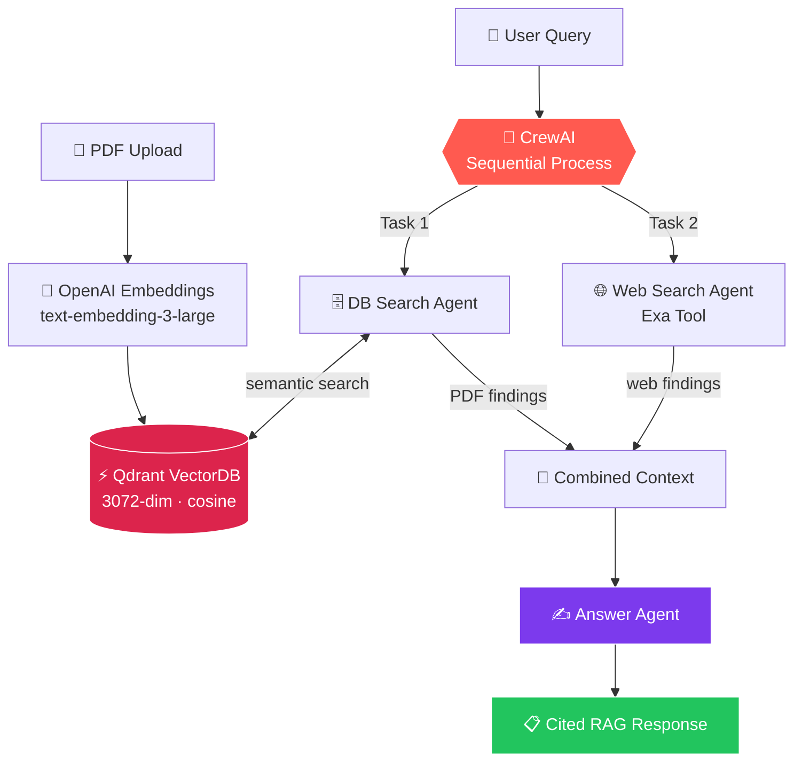

<div align="center">

# 🤖 Web-Augmented Agentic RAG

### Your documents know the past. The web knows the present. This answers with both.

A production-minded **Retrieval-Augmented Generation** system where a team of three
specialised **CrewAI agents** collaborate to answer your questions — one mines your
uploaded PDF, one scours the live web, and one fuses their findings into a single,
fully-cited answer.

[](https://www.python.org/)
[](https://github.com/crewAIInc/crewAI)
[](https://streamlit.io/)
[](https://qdrant.tech/)
[](https://exa.ai/)
[](LICENSE)

</div>

---

## 🧭 Why this exists

Classic RAG has a blind spot: **it can only ever be as current as the document you fed it.**
Ask a vanilla RAG bot "how does this compare to what shipped last month?" and it either
hallucinates or shrugs.

Web-Augmented Agentic RAG closes that gap. Rather than a single retrieval step bolted onto a
prompt, it runs a **genuine multi-agent workflow**: independent researchers work their own
sources, then an analyst reconciles them — and tells you when they disagree.

> **The result:** answers grounded in *your* document, enriched with *today's* web, and
> traceable to both. Every claim carries a page number or a link.

---

## ✨ Features

| | Feature | What it does for you |
|---|---|---|
| 📄 | **PDF Knowledge Base** | Drop in any text PDF — it's chunked, embedded and indexed in seconds |
| 🌐 | **Hybrid Retrieval** | Semantic search over your doc **+** real-time web search via Exa |
| 🤖 | **True Multi-Agent Crew** | Three role-specialised CrewAI agents in a sequential pipeline |
| 🧬 | **High-Fidelity Embeddings** | OpenAI `text-embedding-3-large` at the full **3072** dimensions |
| ⚡ | **Qdrant Vector Store** | Cosine-similarity search that stays fast as your document grows |
| 🔗 | **Citations, Always** | PDF claims cite `(PDF, p. N)`; web claims carry a live link |
| ⚖️ | **Conflict Surfacing** | When doc and web disagree, the answer says so instead of picking silently |
| 💬 | **Chat Interface** | Clean Streamlit UI with conversation history and live agent progress |
| 🔬 | **AgentOps Tracing** | Optional full observability of every agent step, token and tool call |
| 🔐 | **Bring-Your-Own-Keys** | Credentials live in your browser session only — never stored server-side |

---

## 🏗️ Architecture

The system runs a **sequential CrewAI process**. Ingestion happens once per upload; the
three-agent pipeline runs on every question.



### The crew

| Agent | Role | Tool | Responsibility |
|---|---|---|---|
| 🗄️ **DB Search Agent** | PDF Knowledge Base Researcher | `Qdrant PDF Search` | Retrieves relevant passages from your document, quotes them with page numbers, and reports `NO_RELEVANT_PDF_CONTENT` rather than inventing material |
| 🌐 **Web Search Agent** | Web Research Specialist | `ExaSearchTool` | Gathers current, authoritative web information and carries source URLs back with every fact |
| ✍️ **Answer Agent** | Senior Research Analyst | — | Receives both briefs as context, synthesises one Markdown answer, attributes each claim, and flags contradictions |

### Ingestion pipeline

```
PDF → pdfplumber (per-page text)
    → chunker (1000 chars, 200 overlap, word-boundary aware)
    → OpenAI text-embedding-3-large (batched ×64)
    → Qdrant upsert (payload: text + page + source)
```

---

## 🚀 Quick Start

### Prerequisites

| Requirement | Where to get it | Free tier? |
|---|---|---|
| Python 3.11+ | [python.org](https://www.python.org/downloads/) | — |
| OpenAI API Key | [platform.openai.com](https://platform.openai.com/api-keys) | Pay-as-you-go |
| Qdrant URL + API Key | [cloud.qdrant.io](https://cloud.qdrant.io/) | ✅ 1 GB cluster |
| Exa API Key | [dashboard.exa.ai](https://dashboard.exa.ai/api-keys) | ✅ Free credits |
| AgentOps API Key | [app.agentops.ai](https://app.agentops.ai/) | ✅ Optional |

### 1. Clone the repository

```bash
git clone https://github.com/tirth1263/Web-Augmented-Agentic-RAG.git
cd Web-Augmented-Agentic-RAG
```

### 2. Install dependencies

Using [`uv`](https://github.com/astral-sh/uv) (fast, recommended):

```bash
pip install uv
uv venv
uv pip install -r requirements.txt
```

<details>
<summary>Or use plain <code>pip</code></summary>

```bash
python -m venv .venv
# Windows
.venv\Scripts\activate
# macOS / Linux
source .venv/bin/activate

pip install -r requirements.txt
```
</details>

### 3. Set up environment variables *(optional)*

You can enter every key directly in the app's sidebar. To pre-fill them instead, create a
`.env` from the template:

```bash
cp .env.example .env
```

```env
OPENAI_API_KEY="your_openai_api_key"
QDRANT_API_KEY="your_qdrant_api_key"
QDRANT_URL="your_qdrant_cluster_url"
EXA_API_KEY="your_exa_api_key"
AGENTOPS_API_KEY="your_agentops_api_key"
```

### 4. Run the application

```bash
streamlit run main.py
```

The app opens at `http://localhost:8501`.

---

## 📚 Usage Guide

1. **Enter your API keys** — open the sidebar and fill in OpenAI, Qdrant and Exa. Keys are
   held in your browser session only.
2. **Upload a PDF** — the app extracts, chunks, embeds and indexes it automatically. A
   status panel reports each stage, ending with the chunk count.
3. **Ask a question** — the chat box unlocks once a document is indexed.
4. **Watch the crew work** — the DB agent searches your PDF, the web agent queries Exa, and
   the answer agent composes the response.
5. **Read the cited answer** — with a `Sources` section separating document pages from web links.

> 💡 **Tip:** Each upload gets its own isolated Qdrant collection
> (`rag_<filename>_<session>`), so documents never bleed into one another.

---

## 🌍 Deployment

This repo is deployment-ready for several platforms. **Streamlit Community Cloud** is the
fastest path and is free.

### Option A — Streamlit Community Cloud (recommended)

[](https://share.streamlit.io/deploy?repository=tirth1263/Web-Augmented-Agentic-RAG&branch=main&mainModule=main.py)

1. Go to [share.streamlit.io](https://share.streamlit.io/) and sign in with GitHub.
2. Click **Create app → Deploy a public app from GitHub**.
3. Repository `tirth1263/Web-Augmented-Agentic-RAG`, branch `main`, main file `main.py`.
4. *(Optional)* Add keys under **Advanced settings → Secrets** using the format in
   [`.streamlit/secrets.toml.example`](.streamlit/secrets.toml.example).
5. Click **Deploy**. First build takes a few minutes while CrewAI installs.

> ⚠️ **Leave secrets empty for a public demo.** With no secrets set, every visitor supplies
> their own keys in the sidebar — so your OpenAI quota is never spent by strangers.

### Option B — Docker (Render, Railway, Fly.io, Cloud Run, HF Spaces)

```bash
docker build -t agentic-rag .
docker run -p 7860:7860 agentic-rag
```

The image honours `$PORT`, so it drops straight into most PaaS platforms.
A [`render.yaml`](render.yaml) blueprint is included for one-click Render deploys.

---

## 🔧 Configuration

### Agent model

Pick the LLM from the sidebar — `gpt-4o-mini` (default, cheapest), `gpt-4o`, `gpt-4.1-mini`
or `gpt-4.1`. Change the default in `crews.py`:

```python
DEFAULT_MODEL = "gpt-4o-mini"
```

### Chunking & embeddings

Tune retrieval granularity in `qdrant_tool.py`:

```python
EMBEDDING_MODEL = "text-embedding-3-large"
EMBEDDING_DIM   = 3072   # must match your Qdrant collection size
CHUNK_SIZE      = 1000   # characters per chunk
CHUNK_OVERLAP   = 200    # characters shared between neighbours
```

> ⚠️ If you switch to `text-embedding-3-small`, set `EMBEDDING_DIM = 1536` **and** recreate
> your Qdrant collection — a dimension mismatch is rejected at upsert time.

### Agent behaviour

Roles, goals, backstories and task instructions live in `crews.py`. The answer agent's
citation rules and conflict-handling policy are defined in `build_tasks()` — edit the task
description to change the output contract.

---

## 📁 Project Structure

```
Web-Augmented-Agentic-RAG/
├── main.py                      # Streamlit UI, session state, ingestion orchestration
├── crews.py                     # Agents, tasks, and the sequential Crew
├── qdrant_tool.py               # PDF → chunks → embeddings → Qdrant + the CrewAI search tool
├── requirements.txt             # Pinned dependencies
├── pyproject.toml               # Project metadata (uv-compatible)
├── Dockerfile                   # Container image for any PaaS
├── render.yaml                  # Render blueprint
├── .env.example                 # Environment variable template
├── .streamlit/
│   ├── config.toml              # Theme + server settings
│   └── secrets.toml.example     # Secrets template for Streamlit Cloud
└── README.md
```

---

## 🛠️ Tech Stack

| Layer | Technology | Why |
|---|---|---|
| Orchestration | [CrewAI](https://github.com/crewAIInc/crewAI) | Role-based multi-agent workflows with task context passing |
| Interface | [Streamlit](https://streamlit.io/) | Chat UI and file upload with almost no boilerplate |
| Vector DB | [Qdrant](https://qdrant.tech/) | Fast cosine similarity search, generous free tier |
| Web Search | [Exa](https://exa.ai/) | Neural search built for LLM consumption, not SEO spam |
| Embeddings & LLM | [OpenAI](https://openai.com/) | `text-embedding-3-large` + GPT-4o family |
| PDF Parsing | [pdfplumber](https://github.com/jsvine/pdfplumber) | Reliable per-page text extraction with layout awareness |
| Observability | [AgentOps](https://agentops.ai/) | Traces, token accounting and replay for agent runs |

---

## 🧯 Troubleshooting

<details>
<summary><b>"No extractable text found in this PDF"</b></summary>

The PDF is almost certainly a **scanned image**. `pdfplumber` reads text layers, not pixels.
Run the file through OCR (e.g. [OCRmyPDF](https://github.com/ocrmypdf/OCRmyPDF)) first.
</details>

<details>
<summary><b>Qdrant returns a dimension-mismatch error</b></summary>

Your collection was built with a different embedding size. Either restore
`EMBEDDING_DIM = 3072`, or delete the collection so it is recreated at the new size.
</details>

<details>
<summary><b>The app hangs asking to install <code>exa_py</code></b></summary>

`crewai-tools` doesn't pull `exa-py` in automatically and prompts interactively when it's
missing — which blocks a headless server. It's pinned in `requirements.txt`; make sure your
install actually completed.
</details>

<details>
<summary><b>Deployment build times out or runs out of memory</b></summary>

CrewAI has a large dependency tree. On free tiers, let the first build run to completion
without cancelling — subsequent deploys reuse the cache. If memory is the limit, deploy via
the included `Dockerfile` on a platform with a higher RAM ceiling.
</details>

<details>
<summary><b>Rate limits during ingestion of a large PDF</b></summary>

Embeddings are batched 64 at a time. For very large documents on a low OpenAI tier, reduce
`EMBED_BATCH_SIZE` in `qdrant_tool.py`.
</details>

---

## 🗺️ Roadmap

- [ ] Multi-document knowledge bases with cross-document querying
- [ ] Streaming token-by-token output from the answer agent
- [ ] Conversational memory so follow-up questions inherit context
- [ ] Reranking layer between retrieval and synthesis
- [ ] Support for `.docx`, `.md` and raw URLs as sources
- [ ] Hierarchical crew process with a manager agent

---

## 🤝 Contributing

Contributions are welcome. Fork the repo, create a feature branch, and open a pull request.
For substantial changes, please open an issue first to discuss the direction.

---

## 📄 License

Released under the [MIT License](LICENSE).

---

<div align="center">

**Built with CrewAI, Qdrant, Exa and OpenAI**

If this project is useful to you, consider leaving a ⭐

</div>
